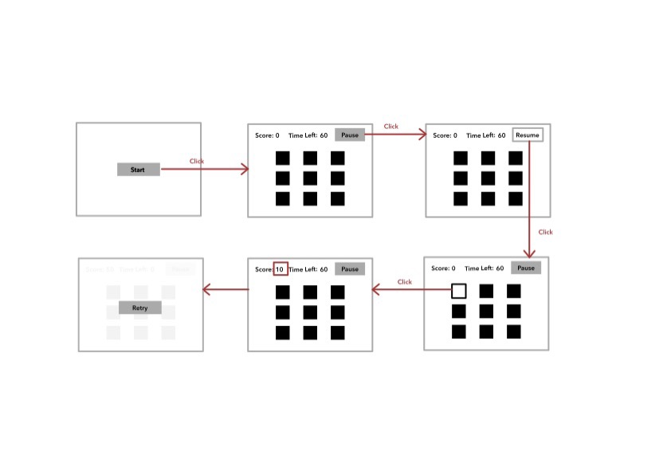

# Build a Whac-a-mole Game Using Vanilla Javascript

- [Build a Whac-a-mole Game Using Vanilla Javascript](#build-a-whac-a-mole-game-using-vanilla-javascript)
  - [User Stories](#user-stories)
  - [User Flow](#user-flow)

## User Stories

- User sees a screen with a line of text saying "Whac-a-Mole" and a "Start" button under it when accessing the game URL.
- User clicks the "Start" button and screen changes. Now, a 3 x 3 grid of black squares is displayed in the center of the screen. On top of the screen, he/she sees 2 pieces of text reading "Score: 0" and "Time Life: 60" respectively. Beside the "Time Life: 60", he/she sees a "Pause" button.
- User notices that the "60" decrements by 1 every second automatically.
- User clicks any one of the squares and he/she notices the "Score: 0" changes to "Score: 10".
- User clicks the "Pause" button and he/she finds the "Time Life: Some Number" stops changeing and the "Pause" button label changes to "Resume".
- User sees a screen with a line of text saying "Game Over" and a "Retry" button under it when "Time Life: 60" changes to "Time Life: 0".
- User clicks the "Retry" button and he/she sees the same screen as he/she clicked the "Start" button.

## User Flow

